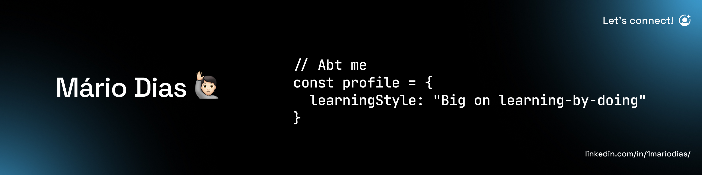

  

## 🚀 About Me

- 🏫 Web Development student @ ESMAD, Porto
- 🎯 Focused on **Full-stack** development (Backend-leaning)
- 🤖 Recently built: [SHIFT — An Event Management Portal](https://github.com/1MarioDias/shift-app)
- 🍸 Part-time Bartender @ Porto's busiest place (LMAO)

## 🛠️ Core Skills

- **Languages:** JavaScript (JS) / Node.js / Python / Java
- **Frontend:** Vue.js / React / Tailwind CSS / HTML5 / CSS3
- **Backend:** Node.js (Express) / REST APIs / Authentication (JWT)
- **Databases:** MongoDB / MySQL / Database Design
- **Testing:** Jest / Selenium
- **Cloud & Tools:** Cloudinary / Git / Linux / Docker / CI/CD
- **Other:** UX Analysis / Figma Prototyping

## 📈 Highlight Projects

- [SHIFT](https://github.com/1MarioDias/shift-app):  
  Full-stack app for event management in smart cities.  
  - RESTful API built on Node.js (Express) / MySQL backend
  - Vue.js frontend, JWT authentication
  - Cloud media (Cloudinary API), microservices architecture
  - Focused on real-world community problem-solving

- [IRLFaceit](https://github.com/1MarioDias/IRLFaceit):  
  Microservices-based sports matchmaking platform inspired by FACEIT.  
  - 4 Core Services + Nginx API Gateway (Docker Swarm)
  - Node.js/Express + MongoDB + Python + FastAPI (Notification Service)
  - RabbitMQ async messaging for Notifications, GraphQL Rating Service
  - Real-world pickup sports lobbies (football, basketball, etc.)

## 💡 Interests & Fun Facts

- 🍹 Into the mixology field for two years
- 🤝 Always open for collaboration on community-driven or open source projects

## 📫 Let’s Connect

- **Email:** mariodiasfreelancer@gmail.com
- **LinkedIn:** [My LinkedIn](https://www.linkedin.com/in/1mariodias/)  
- **Location:** Porto, Portugal | Open to remote/onsite roles

---
